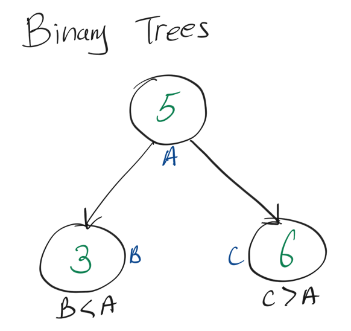

```toc

```

# Resources

Question Source: https://leetcode.com/problems/search-in-a-binary-search-tree/

# Iterative: O(n) / O(1)

## Intuition

**Binary Search Trees** have the property that the the child node on the left of the parent is smaller than the parent, and the child node on the right of the parent is greater than the parent:

 

Since we are given the root of a binary tree, we can traverse the tree based on whether the value of the node is greater than or less than the target:

-   If target > node value, go to right child
-   If target < node value, go to left child
-   If target == node value, return the node
-   If the node becomes `None` then it means the target node does not exist, and return `None`

```python
# Definition for a binary tree node.
class TreeNode:
    def __init__(self, val=0, left=None, right=None):
        self.val = val
        self.left = left
        self.right = right

class Solution:
    def searchBST(self, root, val):
        node = root
        while node != None:
            if node.val == val:
                print(node.val)
                return node
            elif val < node.val:
                node = node.left
            else:
                node = node.right
        return None

node1 = TreeNode(1,None,None)
node3 = TreeNode(3,None,None)
node2 = TreeNode(2,node1,node3)
node7 = TreeNode(7,None,None)
node4 = TreeNode(4,node2,node7)

s = Solution()
print(s.searchBST(node4,2))
```

## Here is a more condensed refactor

```python
# Definition for a binary tree node.
class TreeNode:
    def __init__(self, val=0, left=None, right=None):
        self.val = val
        self.left = left
        self.right = right


class Solution:
    def searchBST(self, root, val):
        node = root
        # combine the if statement into while loop
        while node != None and node.val != val:
            # ternary operater
            node = node.left if val < node.val else node.right
        return node

node1 = TreeNode(1,None,None)
node3 = TreeNode(3,None,None)
node2 = TreeNode(2,node1,node3)
node7 = TreeNode(7,None,None)
node4 = TreeNode(4,node2,node7)

s = Solution()
print(s.searchBST(node4,2))
```

