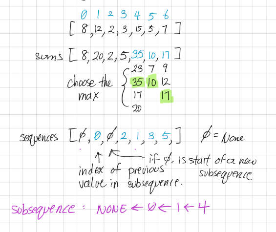

```toc

```

# Overview
## Sources
Question Source: [Code Interview Gym Github](https://github.com/partho-maple/coding-interview-gym/blob/master/algoexpert.io/questions/Max_Sum_Increasing_Subsequence.md)
Resources: AlgoExpert.io

## Description
Given a non-empty array of integers, write a function that returns an array of length 2. The first element in the output array should be an integer value representing the greatest sum that can be generated from a strictly-increasing subsequence in the array. The second element should be an array of the numbers in that subsequence. A subsequence is deemed as a set of numbers that are not necessarily adjacent but that are in the same order as they appear in the array. Assume that there will only be one increasing subsequence with the greatest sum.

```
Sample input: [10, 70, 20, 30, 50, 11, 30]
Sample output: [110, [10, 20, 30, 50]]
```

# Dynamic Programming


