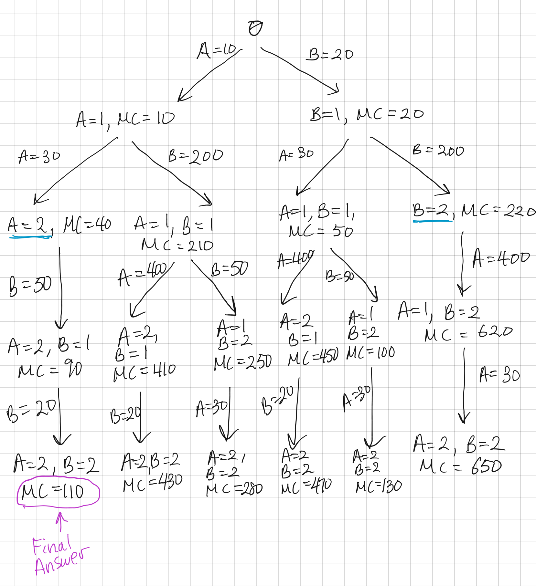
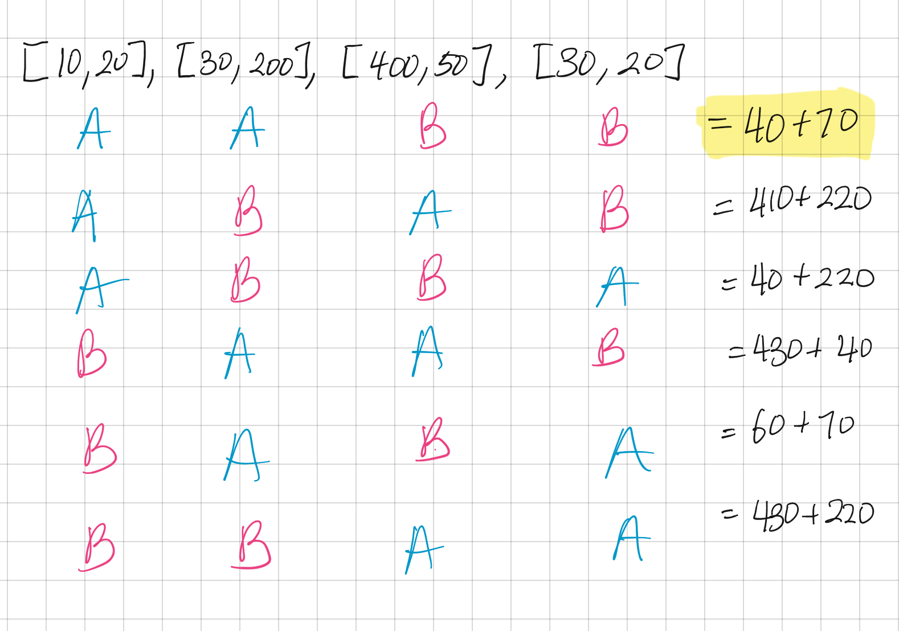
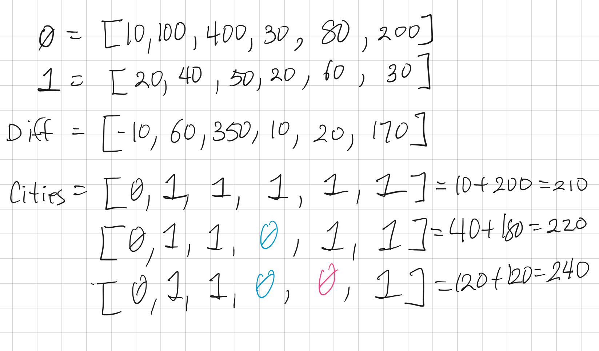
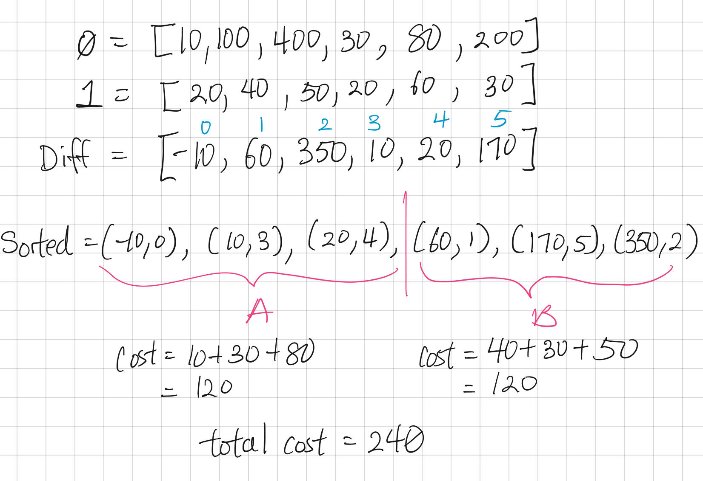

```toc
```

# Overview
## Source
Question Source: [Leetcode](https://leetcode.com/problems/two-city-scheduling/solution/)

## Description
There are 2N people a company is planning to interview. The cost of flying the i-th person to city A is costs[I][0], and the cost of flying the i-th person to city B is costs[I][1].

Return the minimum cost to fly every person to a city such that exactly N people arrive in each city.

**Example 1:**

```
Input: [[10,20],[30,200],[400,50],[30,20]]
Output: 110
Explanation: 
The first person goes to city A for a cost of 10.
The second person goes to city A for a cost of 30.
The third person goes to city B for a cost of 50.
The fourth person goes to city B for a cost of 20.

The total minimum cost is 10 + 30 + 50 + 20 = 110 to have half the people interviewing in each city.
```

**Note:**

    1 <= costs.length <= 100
    It is guaranteed that costs.length is even.
    1 <= costs[I][0], costs[I][1] <= 1000

# O(n^2^) Runtime Solutions
All the solutions below unfortunately require iterating through all the possible combinations in the worst case scenario, resulting in O(n^2^) time complexity, which is not ideal.

## Decision Tree - Top Down Recursion
For every person, we can either send them to City A or City B. But there is a limit for each city that the capacity is only N/2. 

We can make a decision tree and sum up the total cost at all the leaf nodes. Then, choose the leaf node with the least total cost.



## Find all possible combinations
This is essentially the same approach as the decision tree, but instead we find all possible combinations of City A and City B where N/2 people are assigned to each city. Then we add up the total cost of each combination and choose the lowest cost.



## Assign cheapest city, then re-assign
If there were no limits on the capacity for a city, then we would simply take the lowest cost city for every person. This is how we get the `Cities` array below. `0` means assign to City A, and `1` means assign to City B.



But if through that approach we are over-capacity for one city X, then we need to remove people from city X to the other city. The rule for doing this will be that we choose the minimum cost difference.

In the above example, we have too many people in City B. In this case, we need to move people out of City B, and into City A. We want to remove as much cost as possible, and add as little cost as possible. This means we want to maximize the value of (B - A).

`Diff` array shows the difference between A - B. So, since it’s the oppose of what we want, we want to choose the _smallest_ values  from `Diff` to put into City A.

In this case, the smallest `Diff` values are -10, 10 and 20. -10 is already in our Cities array, 10 and 20 need to be moved to City A, which are indexes 3 and 4.


## Dynamic Programming
A dynamic programming solution can be derived from the approach of the above 2 solutions. And the runtime is still O(n^2^) at best.

Some good reads about a DP solution for this problem:
* [Youtube: Two City Scheduling | LeetCode 1029 | C++, Java, Python](https://www.youtube.com/watch?v=cevaICIEyjs)
* [Leetcode Discussions | A dynamic programming solution. No code just explanation.](https://leetcode.com/submissions/detail/348705496/?from=/explore/challenge/card/june-leetcoding-challenge/539/week-1-june-1st-june-7th/3349/)
* [Leetcode Discussions | Java DP - Easy to Understand](https://leetcode.com/problems/two-city-scheduling/discuss/278731/Java-DP-Easy-to-Understand/565645)

## Sorting / Greedy: O(nLogn) / O(n)
Like in the above solutions, we find the `Diff` between each city, but this time, we sort the `Diff` array from least to greatest. 

Since our `Diff` array is the value of A-B, the values that are smallest are the ones that should be assigned to City A, and the values that are largest should be assigned to City B.

When we create `Diff`, we should also include the index of the value, so that we remember which “person” it is after the sort. We can use tuples for that: `(diff, idx)`

The final `sorted` array will look like below, and the first N/2 will be City A, while the latter half is City B.



To get the final cost, we have to use the index saved in each tuple to get the cost and then add them all up.

See a more [formal proof for the Greedy Solution](https://leetcode.com/problems/two-city-scheduling/discuss/667876/Python-Greedy-with-Prove)

```py
class Solution:
    def twoCitySchedCost(self, costs):
        """
        costs type: List[List[int]]
        rtype: int
        """
        diff = [None] * len(costs)
        for i in range(len(costs)):
            val = costs[i][0] - costs[i][1]
            diff[i] = (val,i)
        # print(diff)

        diff.sort()
        # print(diff)

        cost = 0
        for i in range(len(diff)):
            idx = diff[i][1]
            if i < len(diff) / 2:
                cost += costs[idx][0]
            else:
                cost += costs[idx][1]
            # print(cost)
        return cost

s = Solution()
print(s.twoCitySchedCost([[10, 20], [100, 40], [400, 50], [30, 20],[80,60],[200,30]])) # 240
print(s.twoCitySchedCost([[10,20],[30,200],[400,50],[30,20]])) # 110
```

## Using Lambda to Sort: O(n*Logn) / O(1)
The above solution has a space complexity of O(n) because we must store the `Diff` array. This can be improved upon by using `lambda` to reduce space to O(1).

```py
class Solution:
    def twoCitySchedCost(self, costs: List[List[int]]) -> int:
        # Sort by a gain which company has 
        # by sending a person to city A and not to city B
        costs.sort(key = lambda x : x[0] - x[1])
        
        total = 0
        n = len(costs) // 2
        # To optimize the company expenses,
        # send the first n persons to the city A
        # and the others to the city B
        for i in range(n):
            total += costs[i][0] + costs[i + n][1]
        return total
```
