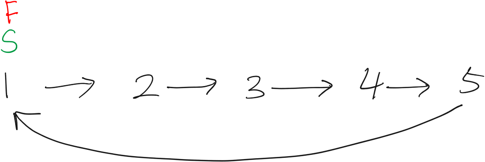
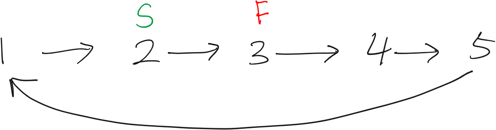
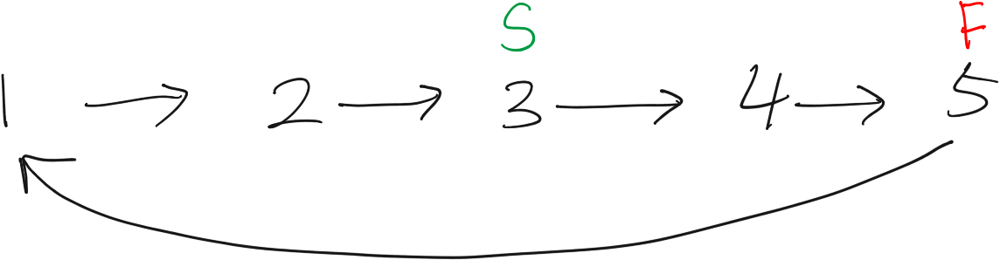
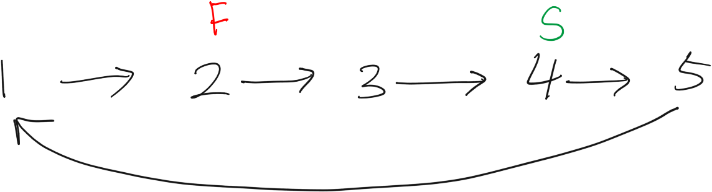
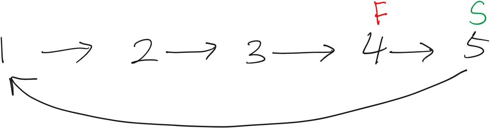
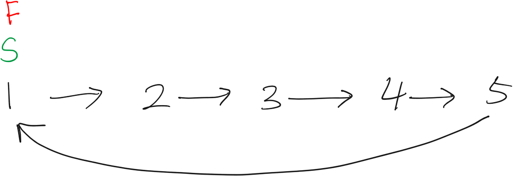
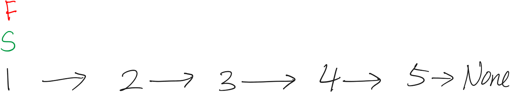
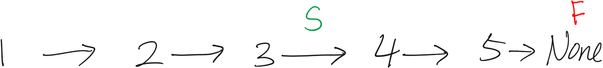

```toc

```

# Resources

Question Source: https://leetcode.com/problems/linked-list-cycle

# Two Pointer: O(n) / O(1)

## Intuition

When there is a cycle, a pointer that traverses the linked list will be caught in the loop forever. It will never reach the `None` state at the end of the linked list.

We can check if there is a loop by having 2 pointers that traverse the linked list at different speeds.

Pointer `slow` moves one node at a time, while pointer `fast` moves 2 node at a time.

*   If there is no cycle, `fast` will arrive at the `None` first before `slow`

-   if there is a cycle, then `fast` will be caught in the loop indefinitely, and eventually `slow` will catch up. Meaning that `fast` and `slow` will meet up at some point.

## Big-O

Our time complexity is O(n) because at most the `fast` pointer will continue to cycle in the loop while the `slow` pointer is catching up. In the below trace, the `slow` pointer had to traverse the entire list, and then meet up with the `fast` pointer at the beginning, so the number of operations was `n + 1`. Depending on the way the graph is cycled, the slow pointer would have to traverse `n + k` nodes, for some `k` where `k < n`. So our runtime is O(n+k) which aysmptotes to O(n).

## Trace

### Cyclical Linked List













### Acyclical Linked List







## Code

```python
# Definition for singly-linked list.
class ListNode:
    def __init__(self, x):
        self.val = x
        self.next = None


class Solution:
    def hasCycle(self, head):
        slow = head
        fast = head
        while fast != None and fast.next != None:
            slow = slow.next
            fast = fast.next.next
            if slow == fast:
                return True
        return False


if __name__ == '__main__':
    # Set up the linked lists
    # 1 -> 2 -> 3 -> 4
    a1 = ListNode('1')
    a2 = ListNode('2')
    a3 = ListNode('3')
    a4 = ListNode('4')

    a1.next = a2
    a2.next = a3
    a3.next = a4

    s = Solution()

    # no cycle - FALSE
    print(s.hasCycle(a1))

    # cycle 4 -> 1 - TRUE
    a4.next = a1
    print(s.hasCycle(a1))

    # cycle 3 -> 2 - TRUE
    a4.next = None
    a3.next = a2
    print(s.hasCycle(a1))

    # edge case: no node - FALSE
    a3.next = a4
    a1 = None
    print(s.hasCycle(a1))

    # edge case: only one node - FALSE
    a1 = ListNode('1')
    a1.next = None
    print(s.hasCycle(a1))
```

# Dictionary: O(n) / O(n)

```python
class LinkedList:
    def __init__(self):
        self.head = ListNode("head")
        self._size = 0

    def insertEnd(self,item): # item is a ListNode
        cur = self.head
        while cur.next is not None:
            cur = cur.next
        cur.next = ListNode(item)
        self._size += 1

    def __str__(self):
        output = ""
        cur_node = self.head.next
        while(cur_node):
            output += str(cur_node.val) + "→"
            cur_node = cur_node.next
        return output

    def cycle(self,node_val):
        if self._size == 0:
            return False
        cur_node = self.head.next
        while cur_node is not None:
            if cur_node.val == node_val:
                dest_node = cur_node
            elif cur_node.next == None:
                last_node = cur_node
            cur_node = cur_node.next
        print(last_node)
        print(dest_node)
        last_node.next = dest_node

class ListNode:
    def __init__(self, x):
        self.val = x
        self.next = None

class Solution:
    def hasCycle(self, head: ListNode) -> bool:
        memo = {}
        if head == None or head.next == None:
            return False
        cur_node = head.next
        while cur_node != None:
            if id(cur_node) not in memo:
                memo[id(cur_node)] = 1
            else:
                return True
            cur_node = cur_node.next
        return False

linked_list = LinkedList()

# Create the linked list
for i in range(1,4):
    linked_list.insertEnd(i)

# Link the list
linked_list.cycle(1)

s = Solution()
print(s.hasCycle(linked_list.head))
```