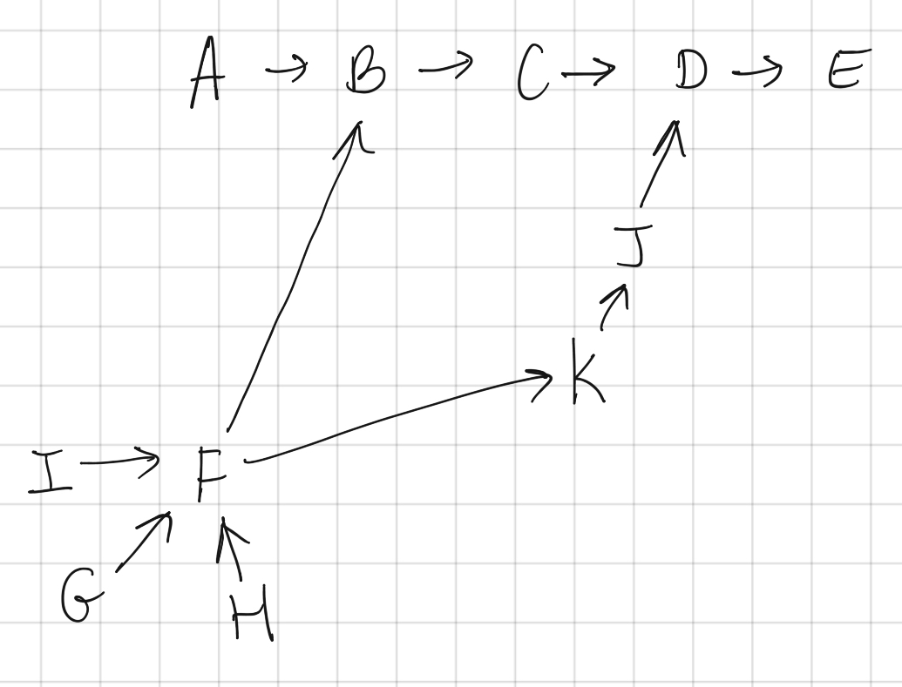

```toc

```

# Resources
Question Source: [Destination City - LeetCode](https://leetcode.com/problems/destination-city/)

# Dictionary: O(n) / O(n)
```python
class Solution:
    def destCity(self, paths):
        dic = {}
        for city in paths:
            dic[city[0]] = city[1]
        # print(dic)
        cur_city = paths[0][0]
        while cur_city in dic:
            cur_city = dic[cur_city]
        return cur_city

s = Solution()
s.destCity([["B","C"],["D","B"],["C","A"]]) # A
s.destCity([["London","New York"],["New York","Lima"],["Lima","Sao Paulo"]]) # Sao Paulo
s.destCity([["A","Z"]]) # Z
```

# Two Sets: O(n) / O(n)
## Intuition

Since no loops are possible, we know that the path can be represented as a graph. For example:



The insight here is that the destination city E is the only "Arrival" city that is not also a "Departure" city.

Even though city `F` has multiple Departure Cities pointing to it and points to mutiple Arrival Cities, it remains that F is only arrived at once. Every single city is only arrived at once because there are no cycles in this graph.

We can represent the Departure and Arrival cities as two separate sets:

```
Departure: {"A","B","C","D","F","G","H","I","J","K"}
Arrival: {"B","C","D","F","G","H","I","J","K","E"}
```

Notice that "E" is unique to the Arrival set and "A" is unique to the Departure set. In fact, we can get both the Destination City and Initial City by subtracting the two sets:

```
initial = Departure - Arrival = {"A"}
destination = Arrival - Departure = {"E"}
```

For a review on how sets work, see [Python Set Operations](https://www.programiz.com/python-programming/set)

To solve the question, we have to get the value for the only element in the Destination set. We can do this easily using `destination.pop()`.

## Code

### Note

Note that this:

```py
depart = set(paths[i][0] for i in range(len(paths)))
arrive = set(paths[i][1] for i in range(len(paths)))
```

And this

```py
depart = set(path[0] for path in range(len(paths)))
arrive = set(path[1] for path in range(len(paths)))
```

Are the same. IMO the bottom one is more readable.

### Code

```py
class Solution:
    def destCity(self, paths):
        depart = set(path[0] for path in range(len(paths)))
        arrive = set(path[1] for path in range(len(paths)))
        return (arrive - depart).pop()
```

The below code is the same as above, but written in one line to be fancy 🤷🏻‍♀️:
```py
class Solution(object):
    def destCity(self, paths):
        return (set([path[1] for path in paths]) - set([path[0] for path in paths])).pop()
```
