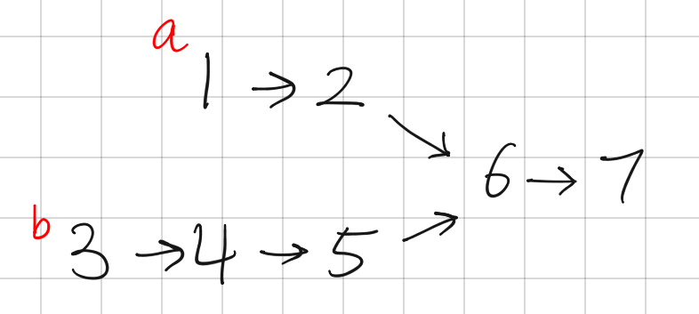

```toc

```

# Resources

Question Source: https://leetcode.com/problems/intersection-of-two-linked-lists

# Two-Pointer Brute Force: O(n^2^) / O(1)

Let's say there are 2 pointers, `a` and `b`. For every `a` we check if `b` is at the same node.



When `a = 1` we'll have to check b = `3`,`4`,`5`...`7` . No matches, so we move `a` and go again...

Now `a = 2` and we'll check b = `3`,`4`,`5`...`7` . No matches, so we move `a` and go again...

Now `a = 6` and we'll check b = `3`,`4`,`5`,`6`. It matches! So `6` is the intersecting node.

However, this approach has an O(n^2^ ) runtime. Suppose `m` is the length of linked list `a` and `n` is the length of linked list `b`. In the worse case scenario, the very last node is the intersection node, and we'll have to do `m*n` checks. When `m=n` we will have `m*m` runtime which is O(n^2^).

The space complexity is O(1) because we've only used two pointers.

# Dictionary: O(n) / O(n)

```python
# Definition for singly-linked list.
class ListNode:
    def __init__(self, x):
        self.val = x
        self.next = None

class Solution:
    def getIntersectionNode(self, headA: ListNode, headB: ListNode) -> ListNode:
        a = headA
        b = headB
        memo = {}

        if not a or not b:
            return None
        elif a.next == b:
            return b
        elif b.next == a:
            return a
        elif a == b:
            return a

        while a.next or b.next:
            if a.next == b.next:
                return a.next
            elif a.next and id(a.next) in memo: 
                return a.next
            elif a.next == headB:
                return headB
            elif b.next == headA:
                return headA
            elif b.next and id(b.next) in memo:
                return b.next
            else:
                if a.next:
                    memo[id(a.next)] = a
                    a = a.next
                if b.next:
                    memo[id(b.next)] = b
                    b = b.next
        return None

if __name__ == '__main__':
    # Set up the linked lists
    a1 = ListNode('1')
    a2 = ListNode('2')
    a3 = ListNode('3')
    a4 = ListNode('4')

    b1 = ListNode('1')
    b2 = ListNode('2')
    b3 = ListNode('3')

    a1.next = a2
    a2.next = a3
    a3.next = a4
    b1.next = b2
    b2.next = b3

    s = Solution()
    assert s.getIntersectionNode(a1,b1)
```

# Set: O(n) / O(n)

```python
class Solution:
    def getIntersectionNode(self, headA: ListNode, headB: ListNode) -> ListNode:
        node_set = set()
        node = headA
        while node:
            node_set.add(node)
            node = node.next

        node2 = headB
        while node2:
            if node2 in node_set:
                break
            node2 = node2.next

        if node2:
            return node2
        return None
```

# Two-Pointer: O(n) / O(1)

```python
# Definition for singly-linked list.
class ListNode:
    def __init__(self, x):
        self.val = x
        self.next = None

class Solution:
    def getIntersectionNode(self, headA, headB): 
        a = headA
        b = headB
        if a == None or b == None:
            return None
        while a != b:
            a = a.next
            b = b.next
            if a == None and b == None:
                return None
            elif a == None:
                a = headB
            elif b == None:
                b = headA
        return a

if __name__ == '__main__':
    # Set up the linked lists
    # 1 -> 2 -> 3 -> 4
    # 1 -> 2 -> 3
    a1 = ListNode('1')
    a2 = ListNode('2')
    a3 = ListNode('3')
    a4 = ListNode('4')

    b1 = ListNode('1')
    b2 = ListNode('2')
    b3 = ListNode('3')

    a1.next = a2
    a2.next = a3
    a3.next = a4
    b1.next = b2
    b2.next = b3

    # no intersection
    s = Solution()
    if s.getIntersectionNode(a1,b1) == None:
        print(s.getIntersectionNode(a1,b1))
    else:
        print(s.getIntersectionNode(a1,b1).val)
        
    # intersection at 2
    b1.next = a2
    
    if s.getIntersectionNode(a1,b1) == None:
        print(s.getIntersectionNode(a1,b1))
    else:
        print(s.getIntersectionNode(a1,b1).val)
    
    # intersection at 4
    b1.next = b2
    b3.next = a4

    if s.getIntersectionNode(a1,b1) == None:
        print(s.getIntersectionNode(a1,b1))
    else:
        print(s.getIntersectionNode(a1,b1).val)

    # intersection at 1
    b1 = a1
    
    if s.getIntersectionNode(a1,b1) == None:
        print(s.getIntersectionNode(a1,b1))
    else:
        print(s.getIntersectionNode(a1,b1).val)

    # None edge case
    b1 = None
    
    if s.getIntersectionNode(a1,b1) == None:
        print(s.getIntersectionNode(a1,b1))
    else:
        print(s.getIntersectionNode(a1,b1).val)
```

