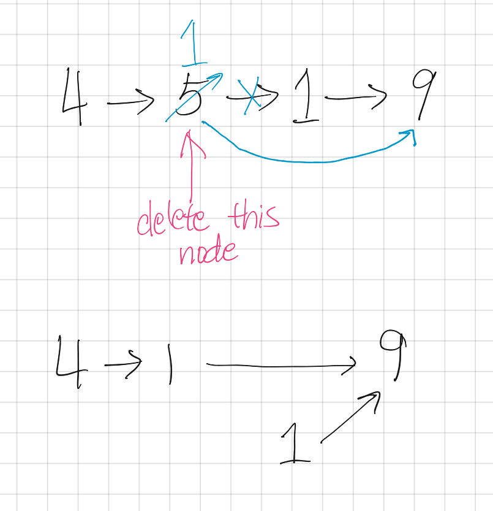

```toc

```

# Resources
Question Source: [Leetcode](https://leetcode.com/problems/delete-node-in-a-linked-list/)

# Solution: O(1) / O(1)
## Intuition
Since we don’t have the pointer to the previous node, we can only get rid of the next node.



2. Have given node take on the value of the next node
3. Set the pointer for given node to the next next node

This effectively results in the singly-linked list looking like it has “deleted” the given node.

## Code

```py
# Definition for singly-linked list.
# class ListNode:
#     def __init__(self, x):
#         self.val = x
#         self.next = None

class Solution:
    def deleteNode(self, node):
        """
        :type node: ListNode
        :rtype: void Do not return anything, modify node in-place instead.
        """
        node.val = node.next.val
        node.next = node.next.next
```