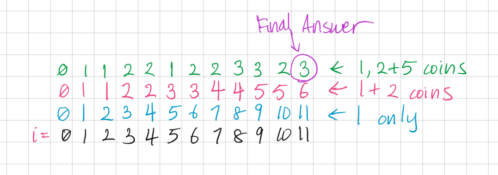

```toc

```

# Resources

Question Source: https://leetcode.com/problems/coin-change

# Dynamic Programming (Bottom-Up)


## May 31, 2020
Runtime: O(a*c) where a = amount, c = number of coins
Space: O(a) where a = amount

```py
class Solution:
    def coinChange(self, coins, amount):
        """
        For a given set of coin denomations, return the smallest number of coins that can be used to add up to a given target amount.
        coins type: List[int]
        amount type: int
        rtype: int
        """
        ways = [float('inf')]*(amount+1)
        ways[0] = 0
        for c in coins:
            for i in range(1,amount+1):
                if i >= c:
                    ways[i] = min(ways[i],ways[i-c]+1)
        # print(ways)
        if ways[-1] == float('inf'):
            return -1
        return ways[-1]


s = Solution()
print(s.coinChange([1],2)) # 2
print(s.coinChange([2],1)) # -1
print(s.coinChange([2],3)) # -1
print(s.coinChange([2,3],4)) # 2
print(s.coinChange([1,2,5],11)) # 3
print(s.coinChange([2, 5, 10, 1],27)) # 4
print(s.coinChange([1,2,5],100))  # 20
print(s.coinChange([431,62,88,428],9084))  # 26
```

# Recursion w/ Memoization (Top-Down)
Good explanation: [Back-to-Back SWE](https://www.youtube.com/watch?v=jgiZlGzXMBw)


## BFS Using Dictionary - May 31, 2020
 **Runtime:**  O(a*c) where a = amount, c = number of coins (forks in the tree)
**Space:** O(a*c) where a = amount, c = number of coins (forks in the tree)

```py
class Solution:
    def coinChange(self, coins, amount):
        """
        For a given set of coin denomations, return the smallest number of coins that can be used to add up to a given target amount.
        coins type: List[int]
        amount type: int
        rtype: int
        """
        if amount == 0:
            return 0

        levels = {1:[]}
        visited = set()
        cur_level = 1
        found = False
        
        for c in coins:
            levels[1].append(c)
        # print(levels)

        while found == False:
            for item in levels[cur_level]:
                if item in visited:
                    continue
                if item == amount:
                    return cur_level
                elif item > amount:
                    continue
                else:
                    if (cur_level + 1) not in levels:
                        levels[cur_level+1]=[]
                    for c in coins:
                        levels[cur_level+1].append(item + c)
                    # print(levels)
                visited.add(item)
            cur_level += 1
            if cur_level not in levels:
                return -1

s = Solution()
print(s.coinChange([1],2)) # 2
print(s.coinChange([2],1)) # -1
print(s.coinChange([2],3)) # -1
print(s.coinChange([2,3],4)) # 2
print(s.coinChange([1,2,5],11)) # 3
print(s.coinChange([2,5,10,1],27)) # 4
print(s.coinChange([1,2,5],100))  # 20
print(s.coinChange([431,62,88,428],9084))  # 26
```

## Using BFS Queue
The above dictionary solution can also be implemented with a Queue, but it looks like the space & time complexity has no improvement.

**Runtime:** O(a*c) where a = amount, c = number of coins (forks in the tree)
**Space:** O(a*c) where a = amount, c = number of coins (forks in the tree)

- - - -
### References
* Top-Down Approach: [Back-to-Back SWE](https://www.youtube.com/watch?v=jgiZlGzXMBw)