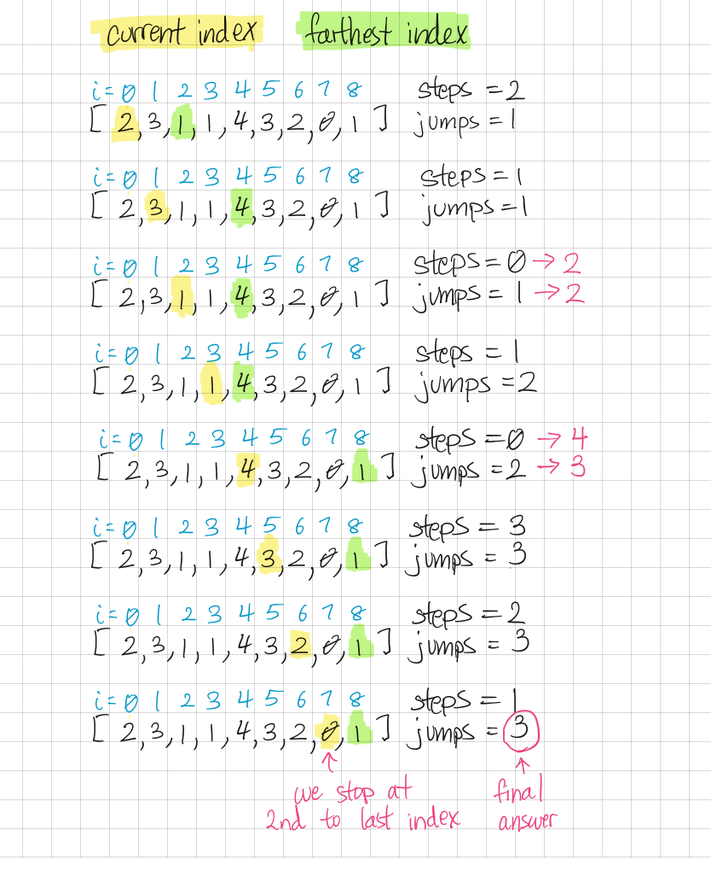

```toc

```

# Overview
## Sources
Question Source: [Leetcode](https://leetcode.com/problems/jump-game-ii)
Resources: AlgoExpert.io

## Description
Given an array of non-negative integers, you are initially positioned at the first index of the array.

Each element in the array represents your maximum jump length at that position.

Your goal is to reach the last index in the minimum number of jumps.

```
Example:

Input: [2, 3, 1, 1, 4]
Output: 2
Explanation: The minimum number of jumps to reach the last index is 2.
Jump 1 step from index 0 to 1, then 3 steps to the last index.
```

> Note: You can assume that you can always reach the last index.  


# Brute Force Solutions
## Intuition
For every index of the array, we can calculate what is the minimum number of steps to arrive at that index from previous indices. By calculating previous indices, we can find the min # of jumps for the final index, which is our answer.

## Brute Force: O(n^2^) / O(n) - Time Limit Exceeded
Time Complexity: where *n* is the length of input array.

```py
 0. 1. 2. 3. 4. 
[2, 3, 1, 1, 4]
 0  1  1  2  2

class Solution:
    def jump(self, nums):
        n = len(nums) #2
        jumps = [float('inf')] * n # [inf,inf]
        jumps[0] = 0 # [0,-inf]
        for i in range(n-1): # 0,1
            for j in range(1,nums[i]+1): # 1->1
                if i+j <= n-1:
	                jumps[i+j] = min(jumps[i]+1,jumps[i+j])
        return jumps[n-1]
```

## Brute Force, slightly optimized - Time Limit Exceeded
The below optimization results in a constance improvement in time complexity, so the final time complexity is still O(n^2^).

```
 0. 1. 2. 3. 4. 
[2, 3, 1, 1, 4, 3, 2, 0, 1]
 0  1  1  2  2  3  3  3  3

class Solution:
    def jump(self, nums):
        n = len(nums)  # 2
        jumps = [float('inf')] * n  # [inf,inf]
        jumps[0] = 0  # [0,-inf]
        for i in range(n-1):  # 0,1
            if jumps[n-1] != float('inf'):
                break
            for j in range(1, nums[i]+1):  # 1->1
                if jumps[n-1] != float('inf'):
                    break
                if i+j <= n-1:
                    if jumps[i+j] == float('inf'):
                      jumps[i+j] = jumps[i]+1
        return jumps[n-1]


s = Solution()
print(s.jump([2, 3, 1, 1, 4]))

```

## Recursive Backtracking - Not Working
This is still pretty much the brute force method, just a different order, and much messier to implement (hence the broken code below).
The idea is to try jumping the farthest possible value at each index (take the greedy approach) and see how many jumps it takes. Then, back-track to previous indexes and jump 1 less every time, and see how many jumps it takes. The downside is we’re still at a time complexity of O(n^2^)  because in the worst case scenario, we will still visit the length of the array at every index.

```py
 0. 1. 2. 3. 4. 
[2, 3, 1, 1, 4, 3, 2, 0, 1]
 0  1  1. 2  2. 3        4 

 0 1 2 3 4 5 6
[4,1,1,3,1,1,1]
 0     1 1 
i = 0
jt = 4
class Solution:
    def jump(self, nums):
        jumps = [float('inf')] * len(nums)
        jumps[0] = 0
        i = 0

        return self._recursion(0, nums, jumps)

    def _recursion(self, i, nums, jumps):
        while jumps[len(nums)-1] == float('inf'):
            cur_val = nums[i]
            if i + cur_val <= len(nums)-1:
                jump_to = i + cur_val
            else:
                jump_to = len(nums)-1
            jumps[jump_to] = jumps[i] + 1
            i = jump_to - 1
            if jumps[i] == float('inf'):
                jumps[i] = jumps[i+1]
                self._recursion(i, nums, jumps)
            else:
                while jumps[i] != float('inf'):
                    if i+1 <= len(nums) -1:
                        i += 1
                    else:
                        break
            
        return jumps[len(nums)-1]

s = Solution()
print(s.jump([1,2,3]))

```

# Dynamic Programming Solution
## Intuition
This is the most elegant solution, with best time & space complexity, but is a bit tricky to understand the intuition behind it.

Essentially we try keep track of the farthest index that we *can* jump to at each index, always keeping the farthest value saved. Whenever But we don’t have to jump _until_ we have used up all the “steps” that we can take. 

At index = 0, the number of steps we can take is always array[0], and the number of jumps we we take will be 1 (because we will do one jump right off the bat).



## DP Code: O(n) / O(1)

```python
class Solution:
    def jump(self, array):
        """
        Given an array of numbers, return the minimum number of jumps needed to reach the last index.
        Assume starting point is index=0, and the jump distance at each index i is array[i].
        Assume it is always possible to reach the last index.
        array type: List[int]
        rtype: int
        """
        # edge case: array is empty or length is 1
        if array == [] or array == None or len(array) == 1:
            return 0
        # start jumping from index 0 and keep track of the farthest we've jumped
        jumps = 1
        farthest = array[0]
        steps_left = array[0]
        for i in range(1,len(array)-1):
            farthest = max(array[i]+i, farthest)
            steps_left -= 1
            if steps_left == 0:
                jumps += 1
                steps_left = farthest - i
        return jumps

s = Solution()
print(s.jump([1,2,3])) # 2
print(s.jump([0])) # 0
print(s.jump([2,3,1])) # 1
print(s.jump([2,3,1,1,4])) # 2
print(s.jump([2,3,1,1,4,3,2,0,1])) # 3
print(s.jump([7,0,9,6,9,6,1,7,9,0,1,2,9,0,3])) # 2
```
