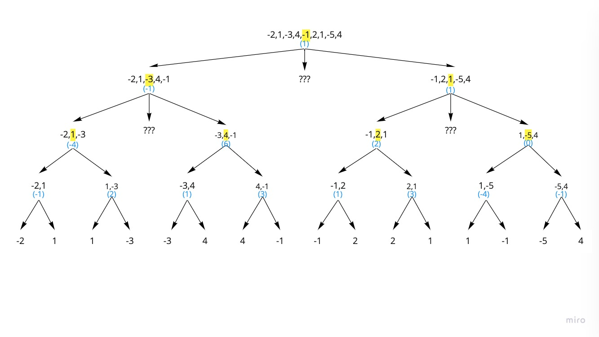
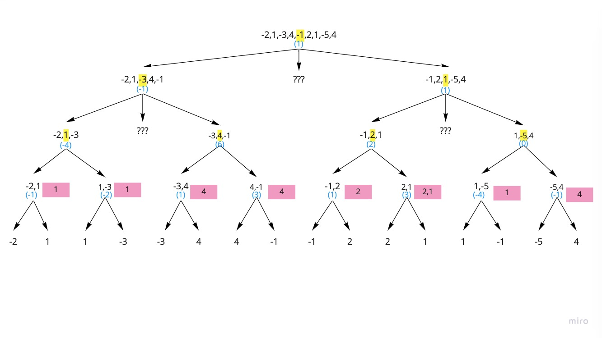
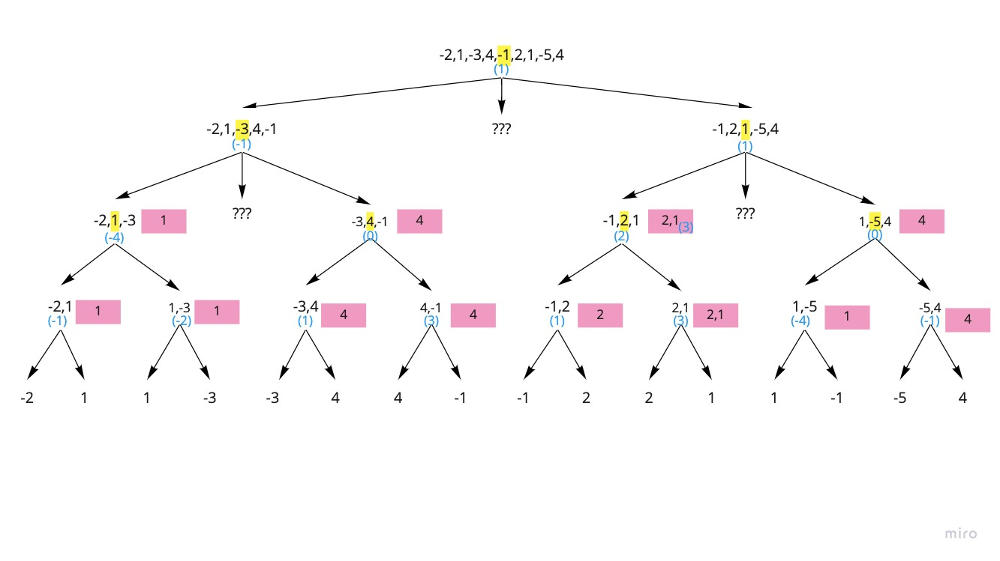
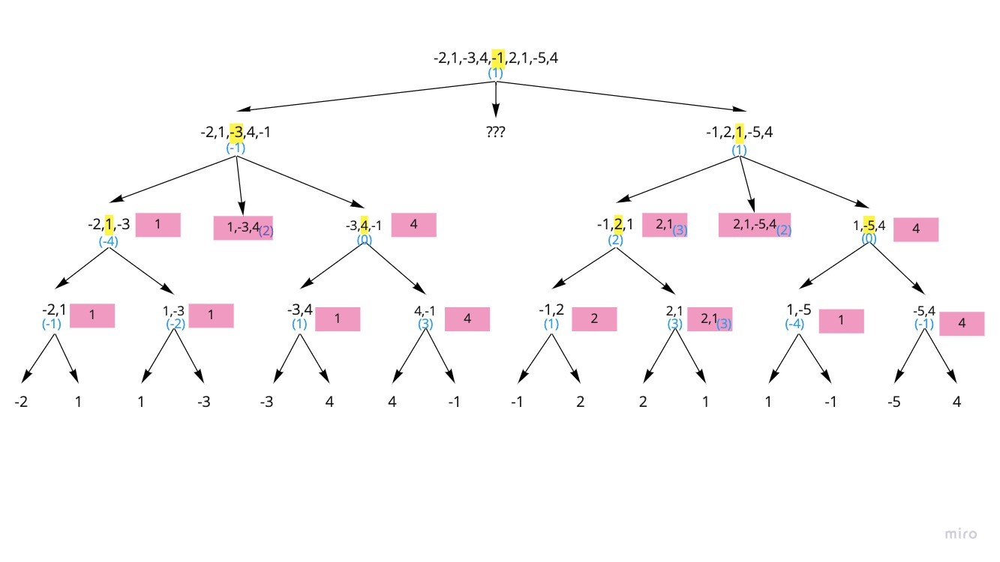
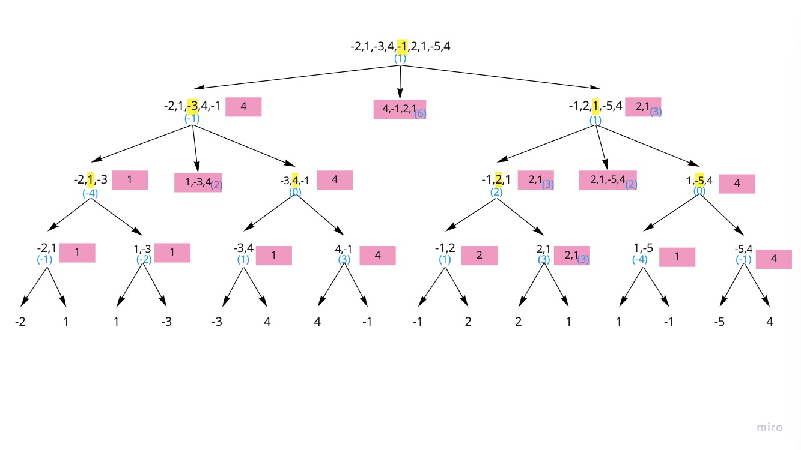
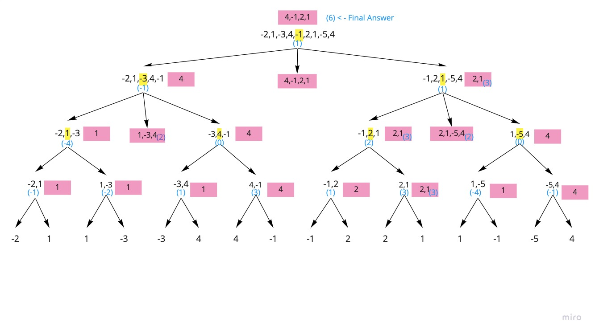

```toc
```

# Overview
## Todo
- [ ] Review Divide & Conquer Solution

## Sources
Question Source: [Maximum Subarray - LeetCode](https://leetcode.com/problems/maximum-subarray/)
Resources:
- Greedy Solution: [Back-to-Back SWE Youtube](https://www.youtube.com/watch?v=2MmGzdiKR9Y)
- Kadane's Algorithm: [Byte-to-Byte Youtube](https://www.youtube.com/watch?v=hPWJNoaI7t8)

## Description
Given an integer array nums, find the contiguous subarray(containing at least one number) which has the largest sum and return its sum.

```text
Example:

Input: [-2, 1, -3, 4, -1, 2, 1, -5, 4],
Output: 6
Explanation: [4, -1, 2, 1] has the largest sum = 6.
Follow up:
```

> If you have figured out the O(n) solution, try coding another solution using the divide and conquer approach, which is more subtle.  

# "Brute Force" One Pointer Approach: O(N) / O(1)
**Runtime:** O(N) because we traverse the array once only.
**Space:** O(1) because we only use a pointer and store values in variables.

## Intuition
This is the solution that I came up with by analyzing the properties of the question on my own. It's messy but helps lead to Kadane's Algorithm below.

* The contiguous subarray cannot start with a negative number, or end with a negative number
* When the subarray includes more than one element, the value of the subarray is the same as if those elements are "merged". For example, [-2,1,-3] has same value as [-1,-3]
* Based on above insights, we can think of our subarray as starting from the left, and expanding toward the right. We must follow the following rules to get the largest possible value:
	* Keep track of the max_val, with max_val initialized as -inf
	* Initialize a start and an end pointer to start traversing the array, starting at index = 0.
	* Initialize a cur_val variable to keep track of the value of our subarray
	* Note we do not actually need to initialize an array to store the subarray. This helps reduce our space complexity from O(N) -> O(1)
	* If the start is a negative number, then the subarray can only be of size one.
		* update cur_val = element value
		* choose max_val = max(cur_val, max_val)
		* move start & end pointer over by 1
	* If the start is a positive number, add the value to our cur_val. Update max_val = max(cur_val, max_val)
	* Move end pointer to the next element, do we include it in the subarray?
		* If element is positive, include it. Update cur_val += element value
		* If element is negative:
			* If element is smaller than the sum of previous values in subarray (which is effectively cur_val), include it. Update cur_val += element value
			* But if the element is larger than the sum of the previous values in subarray, do NOT include it, and end or "close" the subarray there.
				* Example: [2,5,-1] Include -1 in the subarray. This subarray is same value as: [7,-1] and [6]
				* Example: [3,1,-10] Do NOT include -10 in the subarray, as the result will be negative. This subarrayis the same value as [4,-10] or [-6]
	* When the subarray has "closed" then it's time to start a new subarray, and we clear cur_val.
	* Do this until we reach the end of the array
	* Return max_val

## Code

```python
class Solution:
    def maxSubArray(self, array):
        """
        Finds the largest sum possible for a contingous subarray of input array
        array type: list[]
        rtype: int
        """
        max_val = float('-inf')
        cur_val = 0
        for element in array:
            # current element is neg
            if element <= 0:
                # previous subarray was negative, so start a new subarray by clearing cur_val to 0
                if cur_val <= 0:
                    cur_val = 0
                # since cur element is negative, we need to check if adding it to the subarray will result in a negative number. If yes, is the value value at least greater than our max_val?
                # "element + cur_val <= 0" checks whether we are adding the negative number to subarray will keep subarray positivie. 
                # Ex 1: [8,-3] Yes - the net result is positive, so skip this and do NOT start a new subarray.
                # Ex 2: [-3] No - the net result is negative. So we want to consider whether looking at this element by itself is still greater than the max_val. In this case -3 > -inf
                if element + cur_val <= 0 and element + cur_val < max_val:
                    # In this case it is not, so start a new subarray by clearing cur_val
                    cur_val = 0
                    continue
                else:
                    cur_val += element
                    max_val = max(cur_val,max_val)
            # current element is positive
            else:
                # If the previous subarray was a single negative number, so start a new subarray by clearing cur_val to 0
                if cur_val > 0:
                    cur_val += element
                else:
                    cur_val = element
                max_val = max(cur_val, max_val)
        return max_val

s = Solution()
print(s.maxSubArray([-2, 1, -3, 4, -1, 2, 1, -5, 4])) # 6
print(s.maxSubArray([-4])) # -4
print(s.maxSubArray([0])) # 0
print(s.maxSubArray([0,3])) # 3
print(s.maxSubArray([10,3])) # 13
print(s.maxSubArray([-10,-3,0,-5])) # -0
print(s.maxSubArray([-10,-3,-5])) # -3
print(s.maxSubArray([-2,1])) # 1
print(s.maxSubArray([])) # -inf
```

# ⭐️ Dynamic Programming (Kadane's Algorithm): O(N) / O(1)
## Intuition
The previous solution is basically a messy implementation of Kadane's Algorithm.

**The logic is:**
* Adding a negative number to any number (whether positive or negative) results in a small number.
* Thus, if the previous subarray is negative, then don't add the current number to the previous subarray. Start a new subarray instead.
* Keep adding new numbers to the current subarray as long as the subarray stays positive.
* Keep track of the sum of the current subarray by modifying the input array in place
* Keep track of the global max sum using a variable.

## Trace
```
                     i
[-2,1,-3,4,-1,2,1,-5,4] <- input array
[-2,1,-2,4, 3,5,6, 1,5] <- modified array
[-2,1, 1,4, 4,5,6, 6,6] <- max_sum

```

## Code
**Runtime:** O(N) since we have one pointer going through the length of the array
**Space:** O(1) since we are only using pointers

```py
class Solution:
    def maxSubArray(self, array):
      max_val = array[0]
      cur_max_val = array[0]

      for i in range (1,len(array)):
        cur_max_val = max(cur_max_val + array[i], array[i])
        max_val = max(cur_max_val, max_val)

      return max_val
      
```

# ⭐️ Greedy: O(n) / O(1)
## Intuition
The logic is slightly different from Kadane's Algorithm:
* We should only add the current number to our subarray if it results in a sum that is greater than just starting a new subarray.
* Keep track of the current sum (`cur_sum`)using a variable
* Keep track of the global max (`max_val`) using a variable

## Trace
```
[-2,1,-3,4,-1,2,1,-5,4]
[-2,1,-2,4, 3,5,6, 1,5] <- cur_max
[-2,1, 1,4, 4,5,6, 6,6] <- max_val
```

## Code
```py
class Solution:
    def maxSubArray(self, nums):
        max_val = nums[0]
        cur_max = nums[0]
        for i in range(1,len(nums)):
            cur_max = max(nums[i], cur_max + nums[i])
            max_val = max(cur_max, max_val)
        return max_val

s = Solution()
print(s.maxSubArray([-2,1,-3,4,-1,2,1,-5,4]))
```

# Note re. Greedy vs Kadane's
Looking at the trace for both Greedy & Kadane, they are exactly the same. Could Greedy and Kadane have different traces?

Actually no, they have the same traces, because the inherent properties of Math make the Greedy approach and Kadane's work in the same way.

**Greedy**
```
[-4,-9,-3,-2,0,1,3,-2,3]
[-4,-9,-3,-2,0,1,4, 2,5]
```

**Kadane**
```
[-4,-9,-3,-2,0,1,3,-2,3]
[-4,-9,-3,-2,0,1,4, 2,5]
```

**Kadane** says that a new subarray should be created if the previous one is negative.
**Greedy** says that we should add a number to our subarray *only if the sum is greater than starting a new subarray*.

In math, the only way that the sum of the current subarray plus a new item can be greater than taking the new item by itself is if the current subarray is positive.

Thus they end up behaving the same way and having the same trace.

# Divide And Conquer
**Runtime:** O(N*LogN)
**Space:** O(N*LogN)

This solution will actually give us the maximum subarray, unlike the DP solution which only gives us the sum of the max subarray.

## Intuition
The maximum subarray can either be:
1. Completely on the left side of the array
2. Completely on the right side of the array
3. Start on the left side and ends on the right side (straddles both sides)

The intuition is keep bi-secting the subarray into 2 halfs, cutting up and and comparing those 3 options

Starting
* First Let's subdivide the array until there are arrays of only length 1.
* The numbers in **blue parens** are the sum of the arrays for easy reference

Level 1
* Compare the leaf nodes with the parent node.
* The node with the largest value gets promoted up the tree. The pink cards show the **array** (not the value, but the actual array items) being "promoted"

Level 2
* Keep moving up the tree and promote the largest valued subarrays.
* Now we have come to a point where we need to calculate the crosses which are indicated with ???

Level 2-Cross
* To get the appropriate cross-section subarray, take the subarrays with largest value on left side, and go until the end of the subarray with largest value on right side.
* In this example, for the right hand side subarray:
	* the largest subarray on the left is [2,1], with starting index = 5
	* the largest subarray on the right is 4, with index = 8
* So the cross section is array[5:] so the final cross-section subarray is [2,1,-5,4]

Level 0 - Cross
* Now we can do the same thing for the top of the tree, calculating the subarray
* We see that between the values of 4, 6, 3 and -1, 6 is the largest

Level 0 - Final
* So 6 is the final answer
* The subarray is: [4,-1,2,1]

## Code

```py
class Solution:
    def cross_sum(self, nums, left, right, p): 
            if left == right:
                return nums[left]

            left_subsum = float('-inf')
            curr_sum = 0
            for i in range(p, left - 1, -1):
                curr_sum += nums[i]
                left_subsum = max(left_subsum, curr_sum)

            right_subsum = float('-inf')
            curr_sum = 0
            for i in range(p + 1, right + 1):
                curr_sum += nums[i]
                right_subsum = max(right_subsum, curr_sum)

            return left_subsum + right_subsum   
    
    def helper(self, nums, left, right): 
        if left == right:
            return nums[left]
        
        p = (left + right) // 2
            
        left_sum = self.helper(nums, left, p)
        right_sum = self.helper(nums, p + 1, right)
        cross_sum = self.cross_sum(nums, left, right, p)
        
        return max(left_sum, right_sum, cross_sum)
        
    def maxSubArray(self, nums: 'List[int]') -> 'int':
        return self.helper(nums, 0, len(nums) - 1)
```
