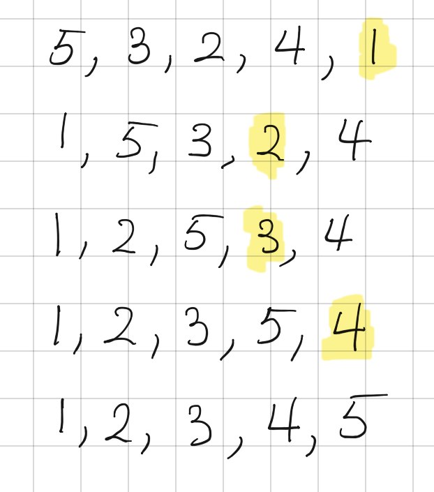
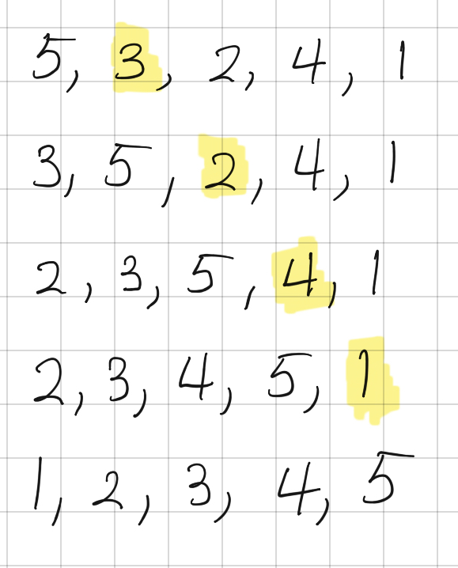

```toc

```

# Overview

## Sources

**Question Source:** [Leetcode](https://leetcode.com/problems/sort-an-array/)
**Merge Sort & Quick Sort:** AlgoExpert

## Description
Given an array of integers nums, sort the array in ascending order.

**Example 1:**

```
Input: nums = [5,2,3,1]
Output: [1,2,3,5]
```

**Example 2:**

```
Input: nums = [5,1,1,2,0,0]
Output: [0,0,1,1,2,5]
```

**Constraints:**

    1 <= nums.length <= 50000
    -50000 <= nums[I] <= 50000

# Simple Sorts
Simple sorts are **In-Place Sorts** meaning the original array is mutated directly and no extra space is needed.

## Selection Sort: O(n^2^) / O(1)
1. Find the smallest item and move it to the front
2. Find the next smallest item and move it to the 2nd place
3. Repeat until entire array is sorted



```py
class Solution:
    def sortArray(self, nums):
        idx = 0
        while idx <= len(nums)-1:
            min_num = float('inf')
            min_idx = None
            for i in range(idx,len(nums)):
                if nums[i] < min_num:
                    min_num = nums[i]
                    min_idx = i
            del nums[min_idx]
            nums.insert(idx,min_num)
            # print(nums)
            idx += 1
        return nums

s = Solution()
print(s.sortArray([5,1,1,2,0,0]))    
print(s.sortArray([5,3,2,4,1]))
```

## Insertion Sort (Bridge Sort): O(n^2^) / O(1)
This is the same way that we would sort cards in a card game.
1. Look at cards one at a time starting from left.
2. Move each card into its proper place compared to cards before it, inserting it between previous cards.



```py
class Solution:
    def sortArray(self, nums):
        for i in range(1,len(nums)):
            cur_val = nums[i]
            for j in range(0,i):
                compare_val = nums[j]
                if compare_val > cur_val:
                    del nums[i]
                    nums.insert(j,cur_val)
                    break
        return nums

s = Solution()
print(s.sortArray([5,1,1,2,0,0]))    
print(s.sortArray([5,3,2,4,1]))
```


# Merge Sort
Merge Sorts are **Stable Sorts**: relative ordering is preserved when any indices are of the same value.

## Top Down (Recursive) Merge Sort: O(n*logn) / O(n*logn)
Assuming input array of `[8,5,2,9,5,6,3]`
```
       [8,5,2,9,5,6,3]
[8,5,2,9]          [5,6,3]
[8,5][2,9]         [5,6][3] 
[8][5][2][9]       [5][6][3]
    --- Start Merging ---            
[5,8][2,9]         [5,6][3]
[2,5,8,9]          [3,5,6]
       [2,3,5,5,6,8,9]
```

**Time Complexity:** (log(n) levels of recursive calls )* (copy n elements at each level) = n*log(n)
**Space Complexity:** (log(n) levels of recursive calls )* (store n elements at each level) = n*log(n)

```py
class Solution:
    def mergeSort(self, array):
        if len(array) <= 1:
            return array
        middle_idx = len(array) // 2
        left_half = array[:middle_idx]
        right_half = array[middle_idx:]
        return mergesorted_arrays(self.mergeSort(left_half), self.mergeSort(right_half))

    def mergesorted_arrays(left_half, right_half):
        sorted_array = [None] * (len(left_half) + len(right_half))
        # k = current index
        # i = left half
        # j = right half
        k = i = j = 0
        while i < len(left_half) and while j < len(right_half):
            if leftHalf[i] <= rightHalf[j]:
                sorted_array[k] = left_half[i]
                i += 1
            else:
                sortedArary[k] = right_half[j]
                j += 1
            k += 1
        while i < len(left_half):
            sorted_array[k] = left_half[i]
            i += 1
            k += 1
        while j < len(right_half)
            sorted_array[k] = right_half[j]
            j += 1
            k += 1
```

## Trace
```
Legend:
a = input array
s = sorted_array
l = left_half
r = right_half
n = None
rt msa(ms(l),ms(r)) = return mergesorted_arrays(mergeSort(l),mergeSort(r))
---

*** Start Recursive Stack Calls ***
---
a = [8,5,2,9,5,6,3]
l = [8,5,2] 
r = [9,5,6,3]
rt msa(ms(l),ms(r))
---
a = [8,5,2]          a = [9,5,6,3]
l = [8]              l = [9,5]
r = [5,2]            r = [6,3]
rt msa(ms(l),ms(r))  rt msa(ms(l),ms(r))
---
a = [8]              a = [5,2]            a = [9,5]            a = [6,3]
rt msa(ms(l),ms(r))  l = [5]              l = [9]              l = [6]
                     r = [2]              r = [2]              r = [3]
                     s = [n,n]            s = [n,n]            s = [n,n]
                     rt msa(ms(l),ms(r))  rt msa(ms(l),ms(r))  rt msa(ms(l),ms(r))

*** mergesorted_arrays() ***
l = [8]       r = [5,2]    l = [9,5]   r = [6,3]
return a
              l = [5]      l = [9]     l = [6]
                   i            i           i
              r = [2]      r = [5]     r = [3]
                   j            j           j
              s = [n,n]    s = [n,n]   s = [n,n]
                   k            k           k
---
l = [8]       r = [5,2]    l = [9,5]   r = [6,3]
return a
              l = [5]      l = [9]     l = [6]
                   i            i           i
              r = [2]      r = [5]     r = [3]
                   j            j           j
              s = [2,n]    s = [5,n]   s = [3,n]
                     k          k           k
---
l = [8]       r = [5,2]    l = [9,5]   r = [6,3]
return a
              l = [5]      l = [9]     l = [6]
                   i            i           i
              r = [2]      r = [5]     r = [3]
                     j            j           j
              s = [2,5]    s = [5,9]   s = [3,6]
                     k          k           k
---
l = [8]       r = [5,2]    l = [9,5]   r = [6,3]
return a
              l = [5]      l = [9]     l = [6]
                     i            i           i
              r = [2]      r = [5]     r = [3]
                     j            j           j
              s = [2,5]    s = [5,9]   s = [3,6]
              return s     return s  return s
*** Returned Values to mergeSort() ***
l = [8,5,2]          r = [9,5,6,3]

l = [8]              l = [5,9]
r = [2,5]            r = [3,6]
rt msa([8],[2,5])    rt msa([5,9],[3,6])
*** mergesorted_arrays() ***
l = [8,5,2]          r = [9,5,6,3]

l = [8]              l = [5,9]
     i                    i
r = [2,5]            r = [3,6]
     j                    j
s = [n,n,n]          s = [n,n,n,n]
---
l = [8,5,2]          r = [9,5,6,3]

l = [8]              l = [5,9]
     i                    i
r = [2,5]            r = [3,6]
     j                    j
s = [2,n,n]          s = [3,n,n,n]
---
l = [8,5,2]          r = [9,5,6,3]

l = [8]              l = [5,9]
     i                    i
r = [2,5]            r = [3,6]
       j                    j
s = [2,n,n]          s = [3,n,n,n]
---
l = [8,5,2]          r = [9,5,6,3]

l = [8]              l = [5,9]
     i                    i
r = [2,5]            r = [3,6]
       j                    j
s = [2,5,n]          s = [3,5,n,n]
---
l = [8,5,2]          r = [9,5,6,3]

l = [8]              l = [5,9]
     i                      i
r = [2,5]            r = [3,6]
         j                  j
s = [2,5,n]          s = [3,5,n,n]
---
l = [8,5,2]          r = [9,5,6,3]

l = [8]              l = [5,9]
     i                      i
r = [2,5]            r = [3,6]
         j                  j
s = [2,5,8]          s = [3,5,6,n]
---
l = [8,5,2]          r = [9,5,6,3]

l = [8]              l = [5,9]
       i                    i
r = [2,5]            r = [3,6]
         j                    j
s = [2,5,8]          s = [3,5,6,n]
---
l = [8,5,2]          r = [9,5,6,3]

l = [8]              l = [5,9]
       i                    i
r = [2,5]            r = [3,6]
         j                    j
s = [2,5,8]          s = [3,5,6,9]
return s
---
l = [8,5,2]          r = [9,5,6,3]

l = [8]              l = [5,9]
       i                      i
r = [2,5]            r = [3,6]
         j                    j
s = [2,5,8]          s = [3,5,6,9]
return s
---
l = [8,5,2]          r = [9,5,6,3]

l = [8]              l = [5,9]
       i                      i
r = [2,5]            r = [3,6]
         j                    j
s = [2,5,8]          s = [3,5,6,9]
return s             return s
*** Repeat until end ***
```

## Bottom Up Merge Sort:  O(n*logn) / O(n*logn)
[free-algos/mergesort.py at master · darekj28/free-algos · GitHub](https://github.com/darekj28/free-algos/blob/master/2_sorting/mergesort.py)
```py
def mergesortBottomUp(a_list): 
	current_size = 1
	  
	# Outer loop for traversing Each  
	# sub array of current_size 
	while current_size < len(a_list): 
		  
		left = 0
		# Inner loop for merge call  
		# in a sub array 
		# Each complete Iteration sorts 
		# the iterating sub array 
		while left < len(a_list)-1: 
			  
			# mid index = left index of  
			# sub array + current sub  
			# array size - 1 
			mid = left + current_size - 1
			  
			# (False result,True result) 
			# [Condition] Can use current_size 
			# if 2 * current_size < len(a)-1 
			# else len(a)-1 
			right = ((2 * current_size + left - 1, 
					len(a_list) - 1)[2 * current_size  
						  + left - 1 > len(a_list)-1]) 
							
			# Merge call for each sub array 
			merge(a_list, left, mid, right) 
			left = left + current_size*2
			  
		# Increasing sub array size by 
		# multiple of 2 
		current_size = 2 * current_size 

def merge(a_list, l, m, r): 
	n1 = m - l + 1
	n2 = r- m 
  
	# create temp arrays 
	L = [0] * (n1) 
	R = [0] * (n2) 
  
	# Copy data to temp arrays L[] and R[] 
	for i in range(0 , n1): 
		L[i] = a_list[l + i] 
  
	for j in range(0 , n2): 
		R[j] = a_list[m + 1 + j] 
  
	# Merge the temp arrays back into a_list[l..r] 
	i = 0     # Initial index of first subarray 
	j = 0     # Initial index of second subarray 
	k = l     # Initial index of merged subarray 
  
	while i < n1 and j < n2 : 
		if L[i] <= R[j]: 
			a_list[k] = L[i] 
			i += 1
		else: 
			a_list[k] = R[j] 
			j += 1
		k += 1
  
	# Copy the remaining elements of L[], if there 
	# are any 
	while i < n1: 
		a_list[k] = L[i] 
		i += 1
		k += 1
  
	# Copy the remaining elements of R[], if there 
	# are any 
	while j < n2: 
		a_list[k] = R[j] 
		j += 1
		k += 1
```
## In-Place Merge Sort: O(n*logn) / O(n)
Swapping values in recursive algorithms is also used in [[Tower of Hanoi]]

```py
class Solution:
    def mergeSort(self, array):
        if len(array) <= 1:
            return array
        aux_array = array[:]
        self.mergeSortHelper(array, 0, len(array)-1, aux_array)
        return array
    
    def mergeSortHelper(main_array, start_idx, end_idx, aux_array):
        if start_idx == end_idx:
            return
        middle_idx = (start_idx + end_idx) // 2
        mergeSortHelper(aux_array, start_idx, middle_idx, main_array)
        mergeSortHelper(aux_array, middle_idx+1, end_idx, main_array)
        self.doMerge(main_array, start_idx, middle_idx, end_idx, aux_array)

    def doMerge(self, main_array, start_idx, middle_idx, end_idx, aux_array):
        k = start_idx
        i = start_idx
        j = middle_idx + 1
        while i <= middle_idx and j <= end_idx:
            if aux_array[i] <= aux_array[j]
                main_array[k] = aux_array[i]
                i += 1
            else:
                main_array[k] = aux_array[j]
                j += 1
            k += 1
        while i <= middle_idx:
            main_array[k] = aux_array[i]
            i += 1
            k += 1
        while j <= middle_idx:
            main_array[k] = aux_array[j]
            j += 1
            k += 1
```

# Quick Sort: O(n*log(n)) / O(log(n))
## Time Complexity Note
**Worst Case:** 
- Every time you split the subarrays, there is 1 tiny short subarray, and then one huge long subarray.
- This is O(n^2^)

**Best Case & Avg Case:**
- Every time you split the subarrays, it is divided exactly in half
- This is O(n*log(n))

## Space Complexity Notes
By applying quick sort on the smaller of the subarrays first, the memory in the recursive call stack is freed up so the most space used at any one time is log(n).

If quick sort is applied on the larger subarray first, then the space complexity increases to O(n).

## Trace
```
[8,5,2,9,5,6,3]
 ^ L         R  5 !> 8, 3 < 8 INCREMENT L

[8,5,2,9,5,6,3]
 ^   L       R  2 !> 8, 3 < 8 INCREMENT L

[8,5,2,9,5,6,3]
 ^     L     R  9 > 8, 3 < 8 SWAP L & R

[8,5,2,3,5,6,9]
 ^     L     R  9 > 8, 3 < 8 SWAP DONE

[8,5,2,3,5,6,9]
 ^       L   R  5 !> 8, 9 !< 8 INCREMENT R

[8,5,2,3,5,6,9]
 ^       L R    5 !> 8, 6 < 8 INCREMENT L

[8,5,2,3,5,6,9]
 ^         R    6 !> 8, 6 < 8 INCREMENT L 
           L

[8,5,2,3,5,6,9]
 ^         R    STOP: L is after R. SWAP R & PIVOT. 8 is final.
             L

[6,5,2,3,5,8,9]
           ^    SORT the shorter right subarray. 9 is len=1 so 9 is final.

[6,5,2,3,5,8,9]
           ^    SORT the longer left subarray: 6 -> 5

[6,5,2,3,5,8,9]
 ^ L     R      5 !> 6, 5 < 6 INCREMEMNT L

[6,5,2,3,5,8,9]
 ^   L   R      2 !> 6, 5 < 6 INCREMEMNT L

[6,5,2,3,5,8,9]
 ^     L R      3 !> 6, 5 < 6 INCREMEMNT L

[6,5,2,3,5,8,9]
 ^       R      5 !> 6, 5 < 6 INCREMEMNT L
         L

[6,5,2,3,5,8,9]
^        R      STOP: L is after R. SWAP R & PIVOT. 6 is final.
           L

[5,5,2,3,6,8,9]
         ^      No short right subarray to sort.

[5,5,2,3,6,8,9]
         ^      SORT the longer left subarray: 5 -> 3

[5,5,2,3,6,8,9]
 ^ L   R        5 !> 5, 3 < 5 INCREMENT L

[5,5,2,3,6,8,9]
 ^   L R        2 !> 5, 3 < 5 INCREMENT L

[5,5,2,3,6,8,9]
 ^     R        3 !> 5, 3 < 5 INCREMENT L
       L

[5,5,2,3,6,8,9]
 ^     R        STOP: L is after R. SWAP R & PIVOT. 5 is final.
         L

[3,5,2,5,6,8,9] No short right subarray to sort.
       ^           

[3,5,2,5,6,8,9] SORT the longer left subarray: 3 -> 2
       ^           

[3,5,2,5,6,8,9] 5 > 3, 2 < 3 SWAP L & R
 ^ L R           

[3,2,5,5,6,8,9] 2 !> 3, 5 > 3 INCREMENT BOTH L AND R
 ^ L R           

[3,2,5,5,6,8,9] STOP: L is after R. SWAP R & PIVOT. 3 is final
 ^ R L           

[2,3,5,5,6,8,9] SORT the right subarray 5. Since length of 5 is 1, 5 is final
 ^ R L           

[2,3,5,5,6,8,9] SORT the left subarray 2. Since length of 2 is 1, 2 is final.
 ^ R L           

Final output: [2,3,5,5,6,8,9]
```

## Code
```py

```